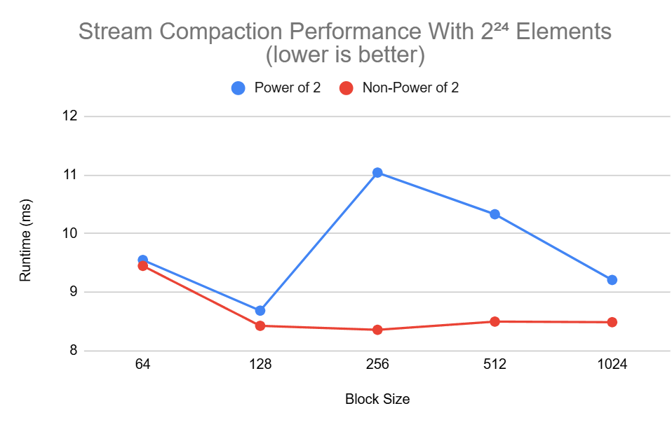

CUDA Stream Compaction
======================

**University of Pennsylvania, CIS 565: GPU Programming and Architecture, Project 2**

* Harris Kokkinakos
  * [LinkedIn](https://www.linkedin.com/in/haralambos-kokkinakos-5311a3210/), [personal website](https://harriskoko.github.io/Harris-Projects/)
* Tested on: Windows 24H2, i9-12900H @ 2.50GHz 16GB, RTX 3070TI Mobile

Project Overview
======================
This project implements and analyzes multiple approaches to two fundamental parallel computing primitives: prefix sum (scan) and stream compaction. The implementation compares CPU-based sequential algorithms against various GPU-accelerated approaches using CUDA, providing insights into parallel algorithm design and performance characteristics across different problem sizes.

Algorithms Implemented
======================
Four different implementations of exclusive prefix sum were developed and analyzed:
1. CPU Sequential Scan: Traditional single-threaded implementation serving as baseline
2. Naive GPU Scan: Direct parallelization using the inclusive-to-exclusive scan approach with ping-pong buffers
3. Work-Efficient GPU Scan: Implementation of the Blelloch scan algorithm using up-sweep and down-sweep phases, based on the approach described in GPU Gems 3
4. Thrust Library Scan: Leveraging NVIDIA's optimized Thrust library implementation

The Work-Efficient GPU Scan was used to implement Stream Compaction for removing zero's from an array of random integers. The algorithm follows the pipeline shown below:
1. Map Phase: Convert input elements to boolean mask (0→0, non-zero→1)
2. Scan Phase: Perform exclusive scan on boolean mask to determine output indices
3. Scatter Phase: Copy non-zero elements to their computed output positions

Performance Analysis
======================
### Scan Algorithm Comparisons


The graph above compares the runtime of each of the implemented algorithms with increasing input array sizes. In almost all cases, Thrust performs the best, which is expected as it is a baseline for this project and is an optimized library developed by NVidia. In the case of 2²⁰ array elements, the Naive implementation does compute the scan result faster than thrust. This is likely due to memory optimizations which are done in my naive implementation. Their performance is extremely similar in this instance which is logical. Comparing to the three implementations written for this project, we see two major points of interest in this graph. The first is between 2¹⁶ and 2²⁰, where Naive begins to out-perform the CPU implementation. Initially, the CPU implementation performs better as a sequential based approach on the CPU will run quicker on lower array sizes. GPU implementations have the overhead of PCIE data transfer and global memory reads which greatly increases the runtime of the algorithms but speed up the arithmetic. Thus, in cases of smaller arrays, arithmetic is not the source of the most overhead, causing the GPU implementations to be slower. However, We see that between the first two array element sizes, the GPU implementation begins to perform better. This is the array input size threshold where the arithmetic begins to have more overhead. The second interesting point on this graph is between 2²⁰ and 2²⁴. This is where the Work Efficient algorithm begins to perform better than the Naive algorithm. The Work Efficient Implementation must spawn double the amount of kernels than the Naive Implementation. This overhead likely causes the increase in runtime compared to Naive until we see the arithmetic become the largest source of overhead as the number of elements increases. The testing for Naive was performed with kernel sizes of 128 and the Naive uses a block size of 256. These were found to be the best performing kernel size for my device as shown below. 

### Scan Block Size Optimizations


As we see in the Naive case, runtime does not change greatly when the array input is large. However, at smaller array sizes, we see that the block size has a larger impact. Here, the block size of 1024 performs best. We can't use this as this is the only case which performs significantly worse in cases of larger arrays. Thus, we settled on 256 as it appears to have the lowest deviation within all cases. For the Work Efficient implementation, we see that block size has little to no impact on arrays with large size except in the case of 256 which is significantly worse. In smaller arrays, block size of 128 yields the shortest runtime.  

### Stream Compaction Runtime


Now that we have our scan implementations, we developed a stream compaction method for removing zeros from an array using the Work Efficient implementation of scan. We then compared this to CPU versions of ways to remove zeros from an array, one with CPU scan and one without. The graph above showcases the runtime of each. Initially at low array sizes, we see that compact without scan is best. However, as we increase array size, compact with scan on CPU performs better and eventually the work efficient stream compaction becomes the quickest. Stream compaction on the GPU uses the scan kernels with block size of 128. the boolean masking and scattering kernels also were found to perform best with a block size of 128 as shown below.

### Stream Compation Block Size Optimization


The graph above shows that the lowest runtime at large array sizes for stream compaction was found with a block size of 128. 

Questions
======================

### Can you find the performance bottlenecks? Is it memory I/O? Computation? Is it different for each implementation?

There are several performance bottlenecks in the implementations developed in this project. The most significant bottleneck is global memory latency. Each global memory access incurs 400-800 cycles of latency, and since the scan algorithms are memory-bound rather than compute-bound, this latency dominates runtime. The implementations rely heavily on repeated global memory reads and writes across multiple kernel launches, amplifying this bottleneck.
Kernel launch overhead presents another major bottleneck, particularly for the work-efficient algorithm which requires approximately double the kernel launches compared to the naive algorithm launches. Finally, underutilized shared memory represents a missed optimization opportunity. The current implementations do not effectively leverage shared memory available per streaming multiprocessor, instead relying on the much slower global memory for all data access.

### Why does Thrust perform the best / what is it doing?

After looking at Nsight Compute, Thrust utilizes shared memory. This is likely already enough to explain such a large difference in runtime as shared memory is tremendously faster to use than global memory. The global memory reads in Thrust also appear to be much faster, which indicates that it may use memory coalescing. 

### Test program output

```
****************
** SCAN TESTS **
****************
    [  20  41  29  12  11   7  46  36   7  26  18  44  39 ...  44   0 ]
==== cpu scan, power-of-two ====
   elapsed time: 64.9505ms    (std::chrono Measured)
    [   0  20  61  90 102 113 120 166 202 209 235 253 297 ... 410869567 410869611 ]
==== cpu scan, non-power-of-two ====
   elapsed time: 54.5937ms    (std::chrono Measured)
    [   0  20  61  90 102 113 120 166 202 209 235 253 297 ... 410869549 410869554 ]
    passed
==== naive scan, power-of-two ====
   elapsed time: 13.3262ms    (CUDA Measured)
    passed
==== naive scan, non-power-of-two ====
   elapsed time: 13.098ms    (CUDA Measured)
    passed
==== work-efficient scan, power-of-two ====
   elapsed time: 7.71533ms    (CUDA Measured)
    passed
==== work-efficient scan, non-power-of-two ====
   elapsed time: 6.77478ms    (CUDA Measured)
    passed
==== thrust scan, power-of-two ====
   elapsed time: 1.83706ms    (CUDA Measured)
    passed
==== thrust scan, non-power-of-two ====
   elapsed time: 1.40493ms    (CUDA Measured)
    passed

*****************************
** STREAM COMPACTION TESTS **
*****************************
    [   2   3   1   0   3   1   0   2   1   2   2   0   3 ...   0   0 ]
==== cpu compact without scan, power-of-two ====
   elapsed time: 72.6697ms    (std::chrono Measured)
    [   2   3   1   3   1   2   1   2   2   3   1   3   3 ...   3   2 ]
    passed
==== cpu compact without scan, non-power-of-two ====
   elapsed time: 68.5979ms    (std::chrono Measured)
    [   2   3   1   3   1   2   1   2   2   3   1   3   3 ...   1   3 ]
    passed
==== cpu compact with scan ====
   elapsed time: 105.959ms    (std::chrono Measured)
    [   2   3   1   3   1   2   1   2   2   3   1   3   3 ...   3   2 ]
    passed
==== work-efficient compact, power-of-two ====
   elapsed time: 9.48928ms    (CUDA Measured)
    passed
==== work-efficient compact, non-power-of-two ====
   elapsed time: 8.56166ms    (CUDA Measured)
    passed
```

Extra Credit
======================

### Block and thread size optimization

One major overhead I found in my original implementation was how many threads and blocks I was spawning. Initially, in work efficient, I was spawning blocks based on input size n. however, I realized I could compute the number of active elements at any stage by doing:
```int num_active_elements = padded_n / (1 << (d + 1));```.
Then, I compute how many blocks are necessary for that many active elements using a ceiling division:
```num_blocks_padded = (padded_n + threads_per_block - 1) / threads_per_block;```. The alternatives to this were using a constant number which will crash the program at large array sizes due to not having enough compute power allocated to complete the task or using the mod operation to figure out the required number. The mod operation yields a similar result, but introduces significant overhead as the mod operation is complex and the GPU does not have any hardware that is designed to perform the operation quickly or independently. 


